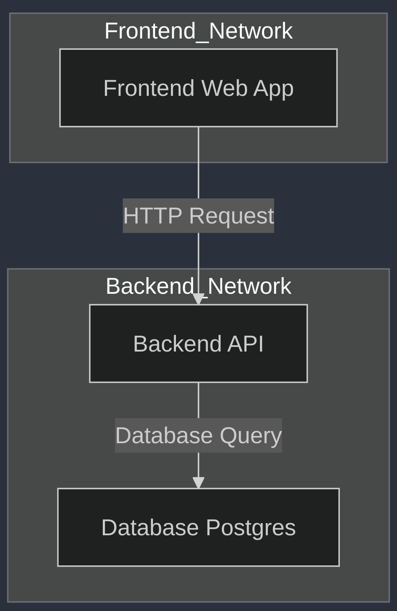

# Docker Networks
Made by Felipe LOBATO


# 

- No internet
- Linux machine
- Hard to test
- Hard to deploy
- Limited connection


# 🚀 Why Use Docker?
Docker simplifies application deployment by containerizing software


✅ **Portable**: Run anywhere: local, cloud, or onpremise


✅ **Lightweight**: Uses fewer resources than traditional VMs


✅ **Scalable**: Easily scale services up or down


✅ **Consistent**: Eliminates "works on my machine" problems


✅ **Fast**: Start, stop, and replicate containers in seconds


# 🌐 Docker Networks
_Containers communicating with each other._


## Main types of network:

🔹 **Bridge (default)** – Isolated network for containers to communicate internally.


🔹 **Host** – Containers share the host's network stack.


🔹 **None** – No network (fully isolated).


🔹 **Overlay** – Multi-host communication (Docker Swarm).


🔹 **Macvlan** – Assigns a MAC address, making the container appear as a physical device on the network.


# 📦 Docker Compose & Networking
_Docker Compose simplifies multi-container applications by defining services in a `docker-compose.yml` file_


✔ A **default bridge network** for services in the same Compose project.


✔ **Named networks** to explicitly control container communication.


✔ **Aliases** for easy service discovery (e.g., `db` for a database container).


🛠 **Example (`docker-compose.yml`):**
```yaml
version: "3"
services:
  app:
    image: myapp
    networks:
      - mynetwork
  db:
    image: postgres
    networks:
      - mynetwork

networks:
  mynetwork:
```

👆 Both `app` and `db` can communicate via `mynetwork` without exposing ports externally.


# Let's work!


# Why is better?
# 


### **Explanation of the Diagram:**
1. **Frontend Network**:
   - The `WebApp` container is part of a **frontend network** (public-facing).
   - It can send requests to the `API` service.

2. **Backend Network**:
   - The `API` service and `Database` are part of an **internal network**.
   - The `WebApp` **cannot communicate** with the `Database` directly (security layer).
   - Only the `API` can access the `Database`, ensuring proper access control.

🔒 **Security Benefit:**
By splitting networks, the database remains **isolated from external access**, reducing attack risks.

Let me know if you need any tweaks! 🚀